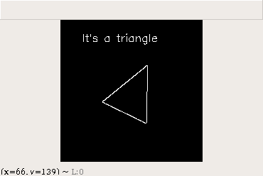
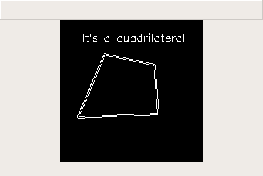
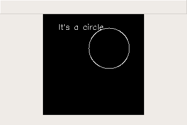

## Shape Analyzer
### Description:
A simple, lightweight CLI that determines if a given image is a triangle, quadrilateral or circle. It implements the OpenCV library and takes advantage of the geometric properties of this shapes. 

### Dependencies:
Python Version: 3.6.6
* OpenCV (https://opencv.org/)

### ScreenShots:

